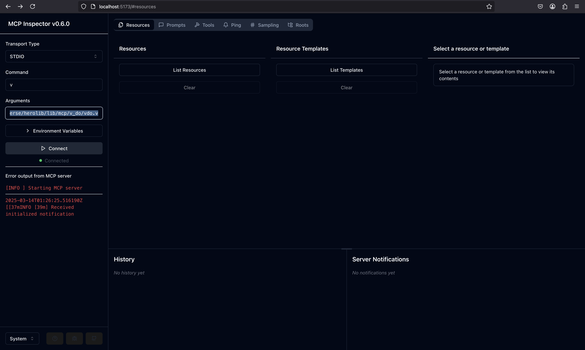

# Inspector Example

This is a simple example of how to use the MCP module to create a server that handles JSON-RPC requests and responses.

## Usage

```v
import freeflowuniverse.herolib.mcp

// Define custom handlers if needed
handlers := {
    'custom_method': my_custom_handler
}

// Create server configuration
config := mcp.ServerConfiguration{
    // Configure server capabilities as needed
}

// Create and start the server
mut server := mcp.new_server(handlers, config)!
server.start()!
```

## Running Example

### Option 1: Using the example script (Recommended)

1. `bash example.sh`
2. The MCP inspector will open automatically in your browser
3. The inspector should connect automatically to the V server

### Option 2: Manual configuration

1. Start the MCP inspector: `npx @modelcontextprotocol/inspector`
2. Open `localhost:5173` in your browser
3. Configure inspector:
    - Transport type: `STDIO`
    - Command: `<path-to-server.vsh>`
    - Arguments: (leave empty)
4. Click "Connect"

### Option 3: Using V directly

1. Start the MCP inspector: `npx @modelcontextprotocol/inspector`
2. Open `localhost:5173` in your browser
3. Configure inspector:
    - Transport type: `STDIO`
    - Command: `v`
    - Arguments: `run <path-to-server.vsh>`
4. Click "Connect"

## Output

Expected output:

