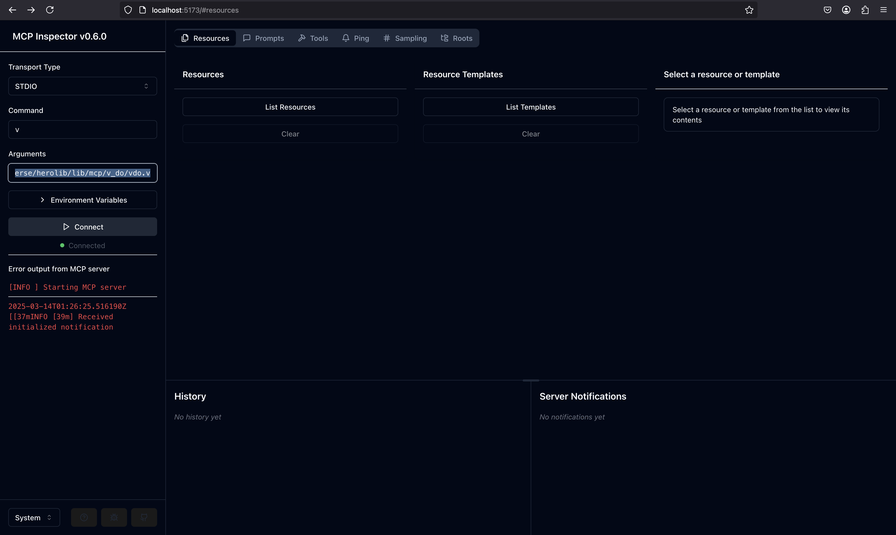

# Inspector Example

This is a simple example of how to use the MCP module to create a server that handles JSON-RPC requests and responses.

## Usage

```v
import freeflowuniverse.herolib.mcp

// Define custom handlers if needed
handlers := {
    'custom_method': my_custom_handler
}

// Create server configuration
config := mcp.ServerConfiguration{
    // Configure server capabilities as needed
}

// Create and start the server
mut server := mcp.new_server(handlers, config)!
server.start()!
```

## Running Example

1. `bash example.sh`
2. `open localhost:5173`
3. Configure inspector:
    - Transport type: `STDIO`
    - Command: `v`
    - Arguments: `-w -n  run /Users/timurgordon/code/github/freeflowuniverse/herolib/lib/mcp/v_do/vdo.v`
4. Connect

## Output

Expected output:
