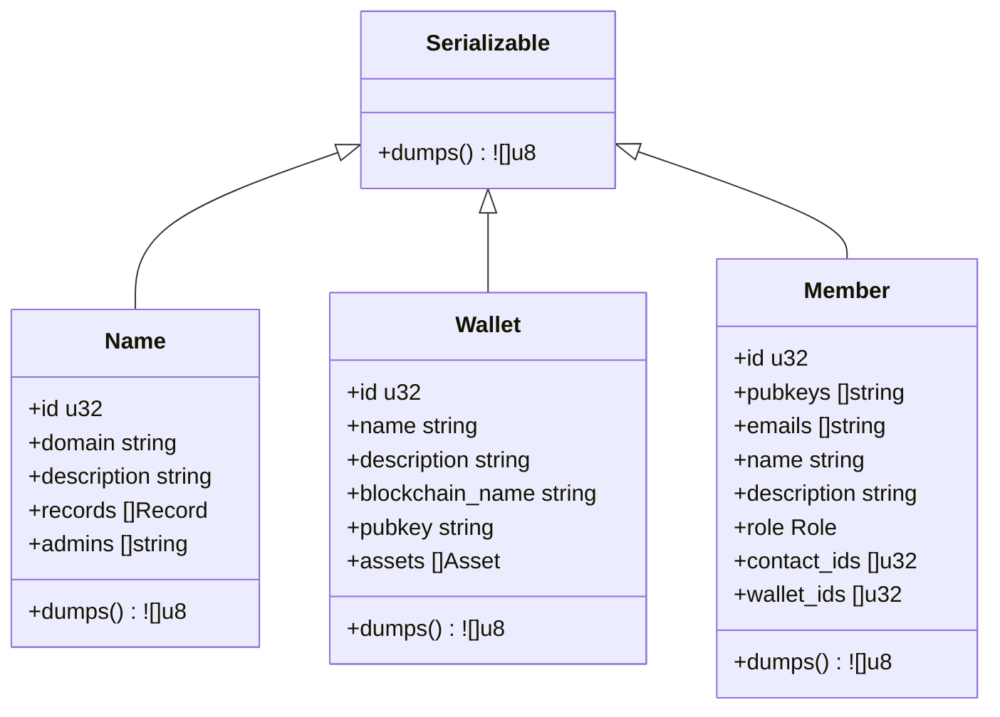
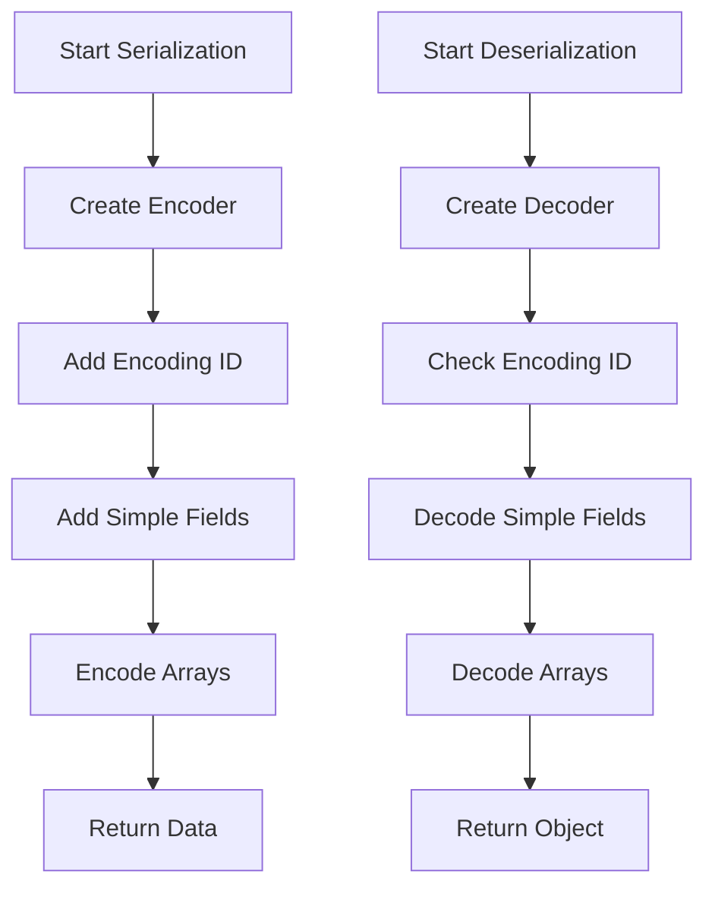
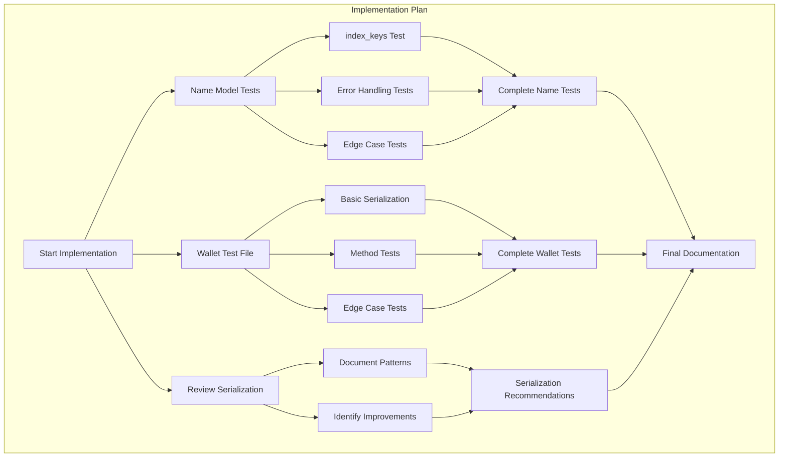

# Testing Plan for Circle Models

## Overview

This document outlines a comprehensive testing strategy for the circle models, with a focus on:
1. Adding tests for the Name model
2. Creating a test file for the Wallet model
3. Reviewing serialization/deserialization mechanisms across all models

## 1. Additional Tests for Name Model

The Name model already has basic serialization/deserialization tests, but we'll add more tests for:

### 1.1 Testing the index_keys() Method

```v
fn test_name_index_keys() {
    // Create a test name
    name := Name{
        id: 123,
        domain: 'example.com',
        description: 'Test domain',
    }
    
    // Get index keys
    keys := name.index_keys()
    
    // Verify the keys
    assert keys['domain'] == 'example.com'
    assert keys.len == 1  // Should only have 'domain' key
    
    println('Name index_keys test passed successfully')
}
```

### 1.2 Error Handling Tests

```v
fn test_name_wrong_encoding_id() {
    // Create invalid data with wrong encoding ID
    mut e := encoder.new()
    e.add_u16(999)  // Wrong ID (should be 300)
    
    // Attempt to deserialize and expect error
    result := name_loads(e.data) or {
        assert err.str() == 'Wrong file type: expected encoding ID 300, got 999, for name'
        println('Error handling test (wrong encoding ID) passed successfully')
        return
    }
    
    assert false, 'Should have returned an error for wrong encoding ID'
}

fn test_name_incomplete_data() {
    // Create incomplete data (missing fields)
    mut e := encoder.new()
    e.add_u16(300)  // Correct ID
    e.add_u32(123)  // ID
    // Missing other fields
    
    // Attempt to deserialize and expect error
    result := name_loads(e.data) or {
        assert err.str().contains('failed to read')
        println('Error handling test (incomplete data) passed successfully')
        return
    }
    
    assert false, 'Should have returned an error for incomplete data'
}
```

### 1.3 Edge Case Tests

```v
fn test_name_long_strings() {
    // Create a name with very long strings
    mut name := Name{
        id: 456,
        domain: 'a'.repeat(1000),  // 1000 character domain
        description: 'b'.repeat(5000),  // 5000 character description
    }
    
    // Add a record with long strings
    name.records << Record{
        name: 'c'.repeat(1000),
        text: 'd'.repeat(5000),
        category: .txt,
        addr: ['e'.repeat(1000)]
    }
    
    // Test serialization
    binary_data := name.dumps() or {
        assert false, 'Failed to encode name with long strings: ${err}'
        return
    }
    
    // Test deserialization
    decoded_name := name_loads(binary_data) or {
        assert false, 'Failed to decode name with long strings: ${err}'
        return
    }
    
    // Verify the decoded data
    assert decoded_name.domain == name.domain
    assert decoded_name.description == name.description
    assert decoded_name.records[0].name == name.records[0].name
    assert decoded_name.records[0].text == name.records[0].text
    assert decoded_name.records[0].addr[0] == name.records[0].addr[0]
    
    println('Long strings test passed successfully')
}

fn test_name_record_limits() {
    // Create a name with a large number of records
    mut name := Name{
        id: 789,
        domain: 'many-records.example.com',
        description: 'A domain with many records',
    }
    
    // Add 100 records
    for i in 0..100 {
        name.records << Record{
            name: 'record-${i}',
            text: 'Text for record ${i}',
            category: RecordType(i % 9),  // Cycle through record types
            addr: ['192.168.1.${i}']
        }
    }
    
    // Test serialization
    binary_data := name.dumps() or {
        assert false, 'Failed to encode name with many records: ${err}'
        return
    }
    
    // Test deserialization
    decoded_name := name_loads(binary_data) or {
        assert false, 'Failed to decode name with many records: ${err}'
        return
    }
    
    // Verify the decoded data
    assert decoded_name.records.len == name.records.len
    
    // Verify a sample of records
    assert decoded_name.records[0].name == name.records[0].name
    assert decoded_name.records[50].name == name.records[50].name
    assert decoded_name.records[99].name == name.records[99].name
    
    println('Record limits test passed successfully')
}
```

## 2. Wallet Model Test File (wallet_test.v)

The Wallet model currently has no test file. We'll create a comprehensive test file covering:

### 2.1 Basic Serialization/Deserialization Tests

```v
module models

import freeflowuniverse.herolib.data.encoder

fn test_wallet_dumps_loads() {
    // Create a test wallet with sample data
    mut wallet := Wallet{
        id: 123,
        name: 'Test Wallet',
        description: 'A test wallet for binary encoding',
        blockchain_name: 'Ethereum',
        pubkey: '0x123456789abcdef',
    }
    
    // Add assets
    wallet.assets << Asset{
        name: 'ETH',
        amount: 1.5
    }
    
    wallet.assets << Asset{
        name: 'USDC',
        amount: 1000.0
    }
    
    // Test binary encoding
    binary_data := wallet.dumps() or {
        assert false, 'Failed to encode wallet: ${err}'
        return
    }
    
    // Test binary decoding
    decoded_wallet := wallet_loads(binary_data) or {
        assert false, 'Failed to decode wallet: ${err}'
        return
    }
    
    // Verify the decoded data matches the original
    assert decoded_wallet.id == wallet.id
    assert decoded_wallet.name == wallet.name
    assert decoded_wallet.description == wallet.description
    assert decoded_wallet.blockchain_name == wallet.blockchain_name
    assert decoded_wallet.pubkey == wallet.pubkey
    
    // Verify assets
    assert decoded_wallet.assets.len == wallet.assets.len
    
    // Verify first asset
    assert decoded_wallet.assets[0].name == wallet.assets[0].name
    assert decoded_wallet.assets[0].amount == wallet.assets[0].amount
    
    // Verify second asset
    assert decoded_wallet.assets[1].name == wallet.assets[1].name
    assert decoded_wallet.assets[1].amount == wallet.assets[1].amount
    
    println('Wallet binary encoding/decoding test passed successfully')
}
```

### 2.2 Test for set_asset() Method

```v
fn test_wallet_set_asset() {
    mut wallet := Wallet{
        id: 456,
        name: 'Asset Test Wallet',
        blockchain_name: 'Bitcoin',
        pubkey: 'bc1q123456789',
    }
    
    // Test adding a new asset
    wallet.set_asset('BTC', 0.5)
    assert wallet.assets.len == 1
    assert wallet.assets[0].name == 'BTC'
    assert wallet.assets[0].amount == 0.5
    
    // Test updating an existing asset
    wallet.set_asset('BTC', 1.0)
    assert wallet.assets.len == 1  // Should still have only one asset
    assert wallet.assets[0].name == 'BTC'
    assert wallet.assets[0].amount == 1.0  // Amount should be updated
    
    // Add another asset
    wallet.set_asset('USDT', 500.0)
    assert wallet.assets.len == 2
    
    // Verify both assets are present with correct values
    for asset in wallet.assets {
        if asset.name == 'BTC' {
            assert asset.amount == 1.0
        } else if asset.name == 'USDT' {
            assert asset.amount == 500.0
        } else {
            assert false, 'Unexpected asset: ${asset.name}'
        }
    }
    
    println('Wallet set_asset test passed successfully')
}
```

### 2.3 Test for total_value() Method

```v
fn test_wallet_total_value() {
    mut wallet := Wallet{
        id: 789,
        name: 'Value Test Wallet',
        blockchain_name: 'Solana',
        pubkey: 'sol123456789',
    }
    
    // Empty wallet should have zero value
    assert wallet.total_value() == 0.0
    
    // Add first asset
    wallet.set_asset('SOL', 10.0)
    assert wallet.total_value() == 10.0
    
    // Add second asset
    wallet.set_asset('USDC', 50.0)
    assert wallet.total_value() == 60.0  // 10 SOL + 50 USDC
    
    // Update first asset
    wallet.set_asset('SOL', 15.0)
    assert wallet.total_value() == 65.0  // 15 SOL + 50 USDC
    
    // Add third asset with negative value (if allowed)
    wallet.set_asset('TEST', -5.0)
    assert wallet.total_value() == 60.0  // 15 SOL + 50 USDC - 5 TEST
    
    println('Wallet total_value test passed successfully')
}
```

### 2.4 Test for index_keys() Method

```v
fn test_wallet_index_keys() {
    wallet := Wallet{
        id: 101,
        name: 'Index Keys Test',
        blockchain_name: 'Polkadot',
        pubkey: 'dot123456789',
    }
    
    keys := wallet.index_keys()
    assert keys['name'] == 'Index Keys Test'
    assert keys['blockchain'] == 'Polkadot'
    assert keys.len == 2
    
    println('Wallet index_keys test passed successfully')
}
```

### 2.5 Edge Case Tests

```v
fn test_wallet_empty_assets() {
    // Test a wallet with no assets
    wallet := Wallet{
        id: 222,
        name: 'Empty Wallet',
        description: 'A wallet with no assets',
        blockchain_name: 'Cardano',
        pubkey: 'ada123456789',
        assets: []
    }
    
    // Test binary encoding
    binary_data := wallet.dumps() or {
        assert false, 'Failed to encode empty wallet: ${err}'
        return
    }
    
    // Test binary decoding
    decoded_wallet := wallet_loads(binary_data) or {
        assert false, 'Failed to decode empty wallet: ${err}'
        return
    }
    
    // Verify the decoded data matches the original
    assert decoded_wallet.id == wallet.id
    assert decoded_wallet.name == wallet.name
    assert decoded_wallet.description == wallet.description
    assert decoded_wallet.blockchain_name == wallet.blockchain_name
    assert decoded_wallet.pubkey == wallet.pubkey
    assert decoded_wallet.assets.len == 0
    
    println('Empty wallet binary encoding/decoding test passed successfully')
}

fn test_wallet_precision() {
    // Test a wallet with assets that have very precise decimal values
    mut wallet := Wallet{
        id: 333,
        name: 'Precision Test Wallet',
        blockchain_name: 'Ethereum',
        pubkey: 'eth123456789',
    }
    
    // Add assets with precise values
    wallet.set_asset('ETH', 0.123456789012345)
    wallet.set_asset('BTC', 0.000000012345678)
    
    // Test binary encoding
    binary_data := wallet.dumps() or {
        assert false, 'Failed to encode precision wallet: ${err}'
        return
    }
    
    // Test binary decoding
    decoded_wallet := wallet_loads(binary_data) or {
        assert false, 'Failed to decode precision wallet: ${err}'
        return
    }
    
    // Verify the precise values are preserved
    for i, asset in wallet.assets {
        decoded_asset := decoded_wallet.assets[i]
        assert decoded_asset.name == asset.name
        assert decoded_asset.amount == asset.amount
    }
    
    println('Wallet precision test passed successfully')
}
```

## 3. Serialization/Deserialization Review

### 3.1 Common Patterns



### 3.2 Encoding Process



### 3.3 Identified Patterns and Consistency

1. **Encoding IDs**: Each model uses a unique encoding ID to identify the data type
   - Name: 300
   - Wallet: 202
   - Member: 201

2. **Serialization Method**: All models implement a `dumps()` method that returns binary data

3. **Deserialization Function**: All models have a static `*_loads()` function that takes binary data and returns an object

4. **Array Handling**: Consistent pattern for encoding/decoding arrays:
   - Write length as u16
   - Write each element
   - When reading, initialize array with length and populate elements

5. **Error Handling**: Consistent approach to error handling with meaningful messages

### 3.4 Improvement Opportunities

1. **Common Interface**: Consider defining a formal interface or trait for serializable objects

```v
// Example interface definition
interface Serializable {
    dumps() ![]u8
    index_keys() map[string]string
}

// Static function for loading any serializable type
fn loads[T](data []u8) !T {
    // Implementation would inspect encoding ID and call appropriate loader
}
```

2. **Version Tracking**: Add version information to handle schema evolution

```v
// Example of adding version support
pub fn (n Name) dumps() ![]u8 {
    mut e := encoder.new()
    e.add_u16(300)  // Type ID
    e.add_u8(1)     // Schema version
    // ... rest of encoding logic
}
```

3. **Data Integrity**: Consider adding checksums or hash verification

```v
// Example of adding checksum
pub fn (n Name) dumps() ![]u8 {
    mut e := encoder.new()
    // ... encoding logic
    
    // Add checksum of data
    checksum := calculate_checksum(e.data)
    e.add_data(checksum)
    
    return e.data
}
```

4. **Enhanced Validation**: Add stronger validation during deserialization

```v
// Example of enhanced validation
pub fn name_loads(data []u8) !Name {
    mut d := encoder.decoder_new(data)
    // ... decoding logic
    
    // Validate domain format
    if !is_valid_domain(name.domain) {
        return error('Invalid domain format: ${name.domain}')
    }
    
    return name
}
```

## 4. Implementation Plan



## 5. Next Steps

1. Implement the additional tests for the Name model
2. Create the new test file for the Wallet model
3. Document the serialization/deserialization findings
4. Consider implementing the recommended improvements