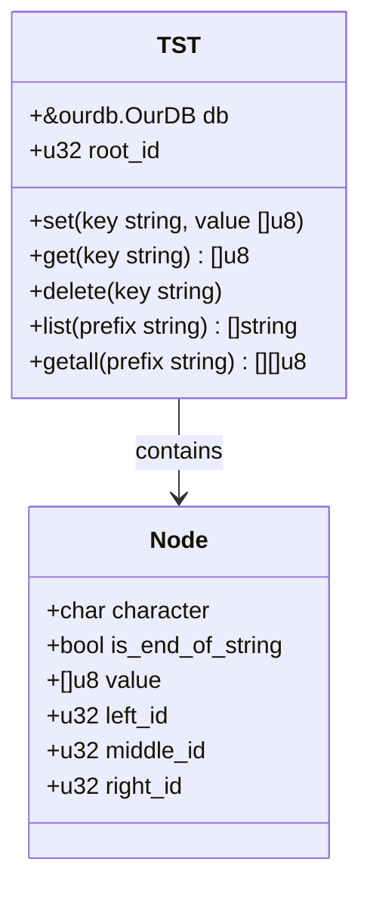
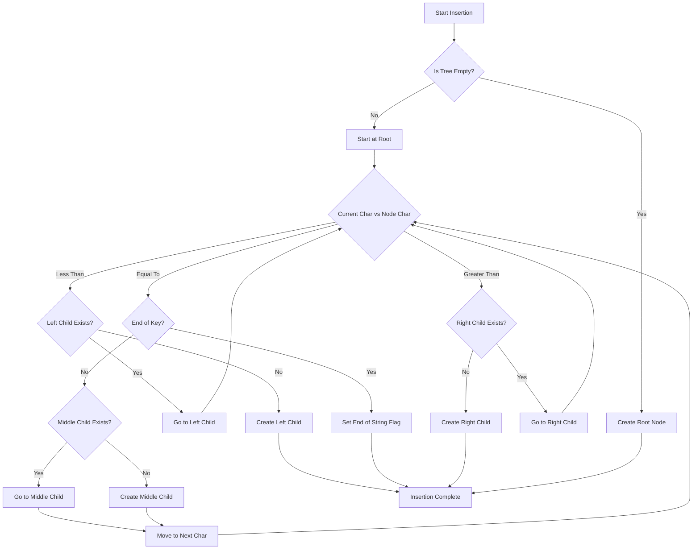
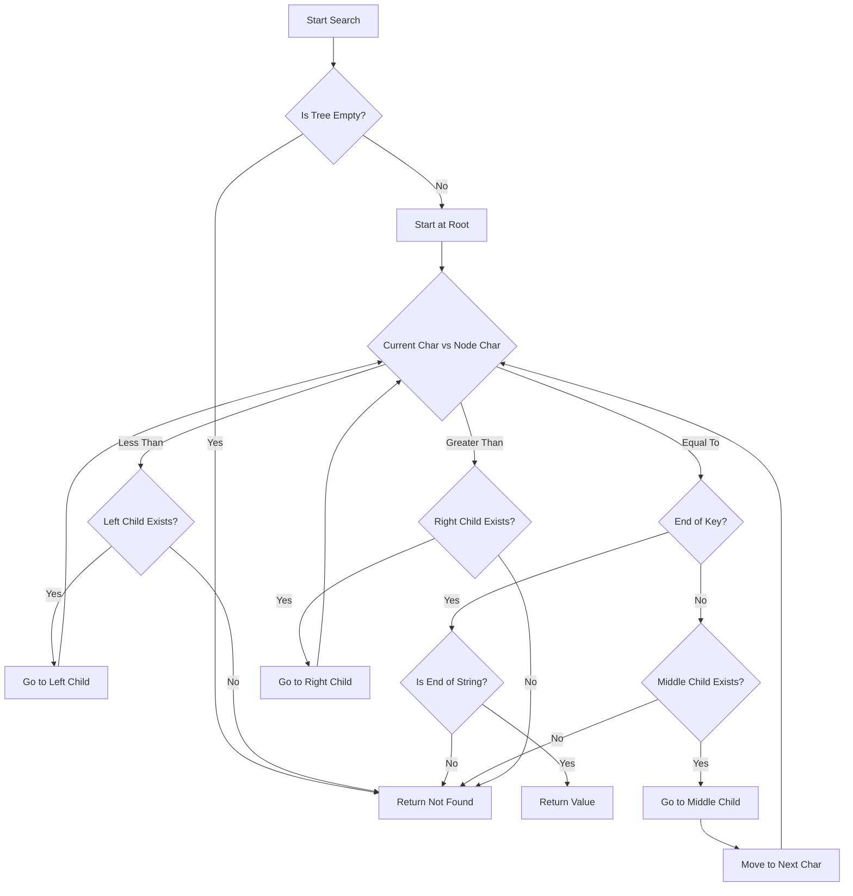
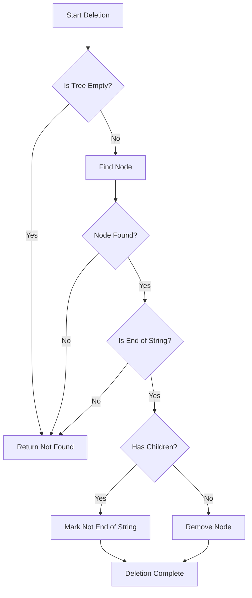
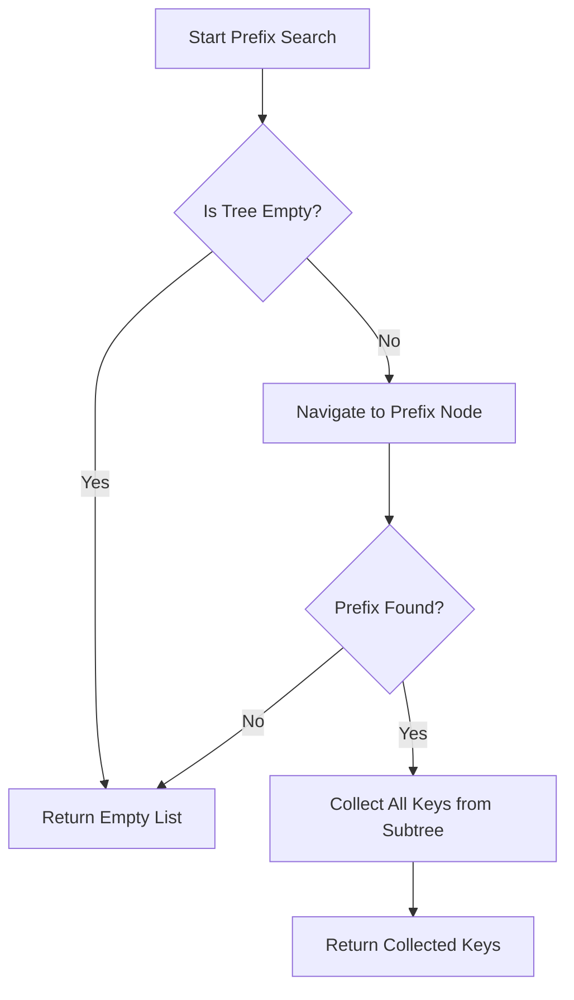
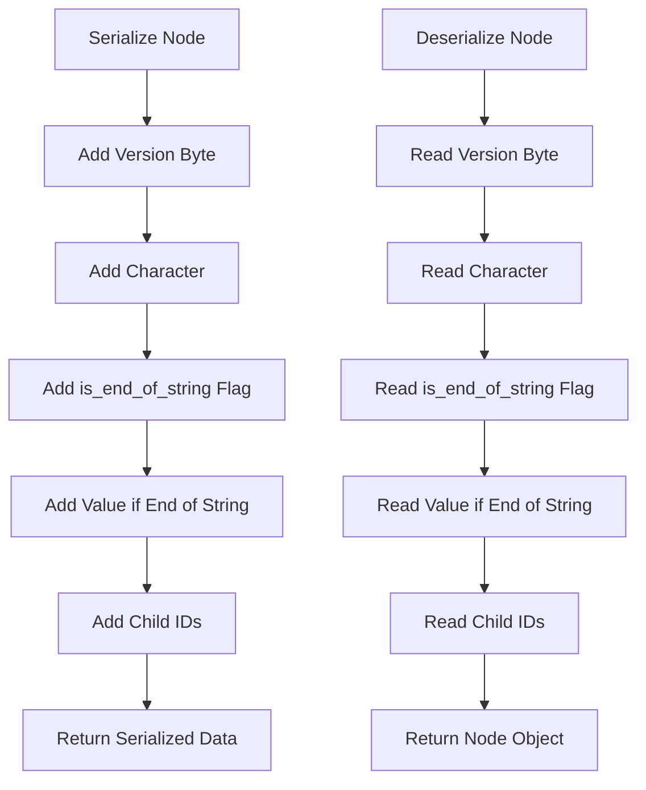

# Ternary Search Tree (TST) Implementation Plan

> STILL BROKEN, CAN'T FIND YET

## Overview

A Ternary Search Tree (TST) is a specialized tree structure where each node has three children:
- Left: For characters less than the current node's character
- Middle: For characters equal to the current node's character (leads to the next character in the sequence)
- Right: For characters greater than the current node's character

In this implementation, we'll focus on the core TST functionality without any balancing mechanisms. Nodes will be inserted in their natural position based on character comparisons.

## Data Structures



## Core Components

1. **Node Structure**:
   - `character`: The character stored at this node
   - `is_end_of_string`: Flag indicating if this node represents the end of a key
   - `value`: The value associated with the key (if this node is the end of a key)
   - `left_id`, `middle_id`, `right_id`: Database IDs for the three children

2. **TST Structure**:
   - `db`: Reference to the ourdb database for persistence
   - `root_id`: Database ID of the root node

3. **Serialization/Deserialization**:
   - Use the same encoder/decoder as the radix tree
   - Serialize node properties efficiently

## Key Operations

### 1. Insertion



The insertion algorithm will:
1. Navigate the tree based on character comparisons
2. Create new nodes as needed
3. Set the end-of-string flag when the entire key is inserted

### 2. Search



### 3. Deletion



For deletion, we'll use a simple approach:
1. If the node has children, just mark it as not end-of-string
2. If the node has no children, remove it from its parent
3. No rebalancing is performed

### 4. Prefix Search



The prefix search will:
1. Navigate to the node representing the end of the prefix
2. Collect all keys in the subtree rooted at that node
3. Return the collected keys

### 5. Serialization/Deserialization



## Implementation Steps

1. **Create Basic Structure (tst.v)**:
   - Define the Node and TST structures
   - Implement constructor function

2. **Implement Serialization (serialize.v)**:
   - Create serialize_node and deserialize_node functions
   - Ensure compatibility with the encoder

3. **Implement Core Operations**:
   - set (insert)
   - get (search)
   - delete
   - list (prefix search)
   - getall (get all values with prefix)

4. **Create Test Files**:
   - Basic functionality tests
   - Prefix search tests
   - Serialization tests
   - Performance tests for various dataset sizes

5. **Add Documentation**:
   - Create README.md with usage examples
   - Add inline documentation

## File Structure

```
tst/
├── tst.v                 # Main implementation
├── serialize.v           # Serialization functions
├── tst_test.v            # Basic tests
├── prefix_test.v         # Prefix search tests
├── serialize_test.v      # Serialization tests
└── README.md             # Documentation
```

## Performance Considerations

1. **Unbalanced Tree Characteristics**:
   - Performance may degrade over time as the tree becomes unbalanced
   - Worst-case time complexity for operations could approach O(n) instead of O(log n)
   - Best for datasets where keys are inserted in a somewhat random order

2. **Optimizations**:
   - Efficient node serialization to minimize storage requirements
   - Careful memory management during traversal operations
   - Optimized string handling for prefix operations

3. **Database Interaction**:
   - Minimize database reads/writes
   - Only create new nodes when necessary

4. **Large Dataset Handling**:
   - Efficient prefix search algorithm
   - Optimize node structure for millions of entries