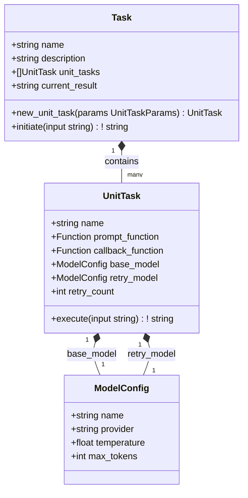

# Escalayer Architecture

This document outlines the architecture for the Escalayer module, which provides a framework for executing AI tasks with automatic escalation to more powerful models when needed.

## 1. Module Structure

```
lib/mcp/aitools/escalayer/
├── escalayer.v         # Main module file with public API
├── task.v              # Task implementation
├── unit_task.v         # Unit task implementation
├── models.v            # Model definitions and configurations
├── openrouter.v        # OpenRouter API client
└── README.md           # Documentation
```

## 2. Core Components

### 2.1 Data Structures



### 2.2 Component Descriptions

#### Task
- Represents a complete AI task composed of multiple sequential unit tasks
- Manages the flow of data between unit tasks
- Tracks overall task progress and results

#### UnitTask
- Represents a single step in the task
- Contains a prompt function that generates the AI prompt
- Contains a callback function that processes the AI response
- Manages retries and model escalation

#### ModelConfig
- Defines the configuration for an AI model
- Includes model name, provider, and parameters like temperature and max tokens

#### OpenRouter Client
- Handles communication with the OpenRouter API
- Sends prompts to AI models and receives responses

## 3. Implementation Details

### 3.1 escalayer.v (Main Module)

```v
module escalayer

import freeflowuniverse.herolib.clients.openai

// TaskParams defines the parameters for creating a new task
@[params]
pub struct TaskParams {
pub:
    name        string
    description string
}

// Create a new task
pub fn new_task(params TaskParams) &Task {
    return &Task{
        name: params.name
        description: params.description
        unit_tasks: []
        current_result: ''
    }
}

// Default model configurations
pub fn default_base_model() ModelConfig {
    return ModelConfig{
        name: 'gpt-3.5-turbo'
        provider: 'openai'
        temperature: 0.7
        max_tokens: 20000
    }
}

pub fn default_retry_model() ModelConfig {
    return ModelConfig{
        name: 'gpt-4'
        provider: 'openai'
        temperature: 0.7
        max_tokens: 40000
    }
}
```

### 3.2 task.v

```v
module escalayer

// Task represents a complete AI task composed of multiple sequential unit tasks
pub struct Task {
pub mut:
    name string
    description string
    unit_tasks []UnitTask
    current_result string
}

// UnitTaskParams defines the parameters for creating a new unit task
struct UnitTaskParams {
    name string
    prompt_function fn(string) string
    callback_function fn(string)! string
    base_model ?ModelConfig
    retry_model ?ModelConfig
    retry_count ?int
}

// Add a new unit task to the task
pub fn (mut t Task) new_unit_task(params UnitTaskParams) &UnitTask {
}

// Initiate the task execution
pub fn (mut t Task) initiate(input string)! string {

```

### 3.3 unit_task.v

```v
module escalayer

import freeflowuniverse.herolib.clients.openai

// UnitTask represents a single step in the task
pub struct UnitTask {
pub mut:
    name string
    prompt_function fn(string) string
    callback_function fn(string)! string
    base_model ModelConfig
    retry_model ModelConfig
    retry_count int
}

// Execute the unit task
pub fn (mut ut UnitTask) execute(input string)! string {
}
```

### 3.4 models.v

```v
module escalayer

// ModelConfig defines the configuration for an AI model
pub struct ModelConfig {
pub mut:
    name string
    provider string
    temperature f32
    max_tokens int
}

// Call an AI model using OpenRouter
fn call_ai_model(prompt string, model ModelConfig)! string {
    // Get OpenAI client (configured for OpenRouter)
    mut client := get_openrouter_client()!
    
    // Create the message for the AI
    mut m := openai.Messages{
        messages: [
            openai.Message{
                role: .system
                content: 'You are a helpful assistant.'
            },
            openai.Message{
                role: .user
                content: prompt
            }
        ]
    }
    
    // Call the AI model
    res := client.chat_completion(
        msgs: m,
        model: model.name,
        temperature: model.temperature,
        max_completion_tokens: model.max_tokens
    )!
    
    // Extract the response content
    if res.choices.len > 0 {
        return res.choices[0].message.content
    }
    
    return error('No response from AI model')
}
```

### 3.5 openrouter.v

```v
module escalayer

import freeflowuniverse.herolib.clients.openai
import os

// Get an OpenAI client configured for OpenRouter
fn get_openrouter_client()! &openai.OpenAI {
    // Get API key from environment variable
    api_key := os.getenv('OPENROUTER_API_KEY')
    if api_key == '' {
        return error('OPENROUTER_API_KEY environment variable not set')
    }
    
    // Create OpenAI client with OpenRouter base URL
    mut client := openai.new(
        api_key: api_key,
        base_url: 'https://openrouter.ai/api/v1'
    )!
    
    return client
}
```

## 4. Usage Example

```v
import freeflowuniverse.herolib.mcp.aitools.escalayer

fn main() {
    // Create a new task
    mut task := escalayer.new_task(
        name: 'rhai_wrapper_creator'
        description: 'Create Rhai wrappers for Rust functions'
    )
    
    // Define the unit tasks
    task.new_unit_task(
        name: 'separate_functions'
        prompt_function: separate_functions
        callback_function: process_functions
    )
    
    task.new_unit_task(
        name: 'create_wrappers'
        prompt_function: create_wrappers
        callback_function: process_wrappers
        retry_count: 2
    )
    
    task.new_unit_task(
        name: 'create_tests'
        prompt_function: create_tests
        callback_function: process_tests
        base_model: escalayer.ModelConfig{
            name: 'claude-3-haiku-20240307'
            provider: 'anthropic'
            temperature: 0.5
            max_tokens: 4000
        }
    )
    
    // Initiate the task
    result := task.initiate('path/to/rust/file.rs') or {
        println('Task failed: ${err}')
        return
    }
    
    println('Task completed successfully')
    println(result)
}

// Define the prompt functions
fn separate_functions(input string) string {
    return 'Read rust file and separate it into functions ${input}'
}

fn create_wrappers(input string) string {
    return 'Create rhai wrappers for rust functions ${input}'
}

fn create_tests(input string) string {
    return 'Create tests for rhai wrappers ${input}'
}

// Define the callback functions
fn process_functions(response string)! string {
    // Process the AI response
    // Return error if processing fails
    if response.contains('error') {
        return error('Failed to process functions: Invalid response format')
    }
    return response
}

fn process_wrappers(response string)! string {
    // Process the AI response
    // Return error if processing fails
    if !response.contains('fn') {
        return error('Failed to process wrappers: No functions found')
    }
    return response
}

fn process_tests(response string)! string {
    // Process the AI response
    // Return error if processing fails
    if !response.contains('test') {
        return error('Failed to process tests: No tests found')
    }
    return response
}
```
