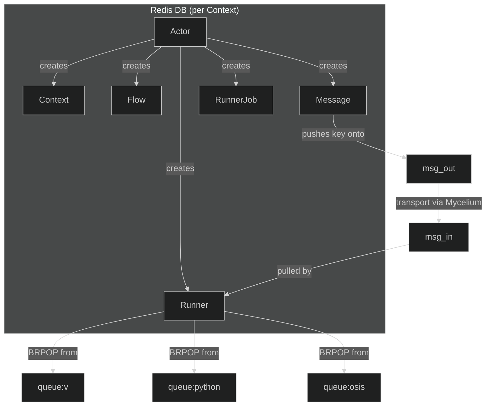

# Models Specification  
*Freeflow Universe – mycojobs*  

This document gathers **all data‑models** that exist in the `lib/mycojobs/model/` package, together with a concise purpose description, field semantics, Redis storage layout and the role each model plays in the overall *decentralised workflow* architecture.

## Table of Contents
1. [Actor](#actor)  
2. [Context](#context)  
3. [Flow](#flow)  
4. [Message](#message)  
5. [Runner](#runner)  
6. [RunnerJob](#runnerjob)  
7. [Enums & Shared Types](#enums-shared-types)  
8. [Key‑generation helpers](#key-generation-helpers)  

---  

## 1️⃣ `Actor` – Identity & entry‑point

| Field | Type | Description |
|------|------|-------------|
| `id` | `u32` | Sequential identifier **unique per tenant**. Used as part of the Redis key `actor:<id>`. |
| `pubkey` | `string` | Public key (Mycelium‑compatible) that authenticates the actor when it sends/receives messages. |
| `address` | `[]Address` | One or more reachable addresses (normally Mycelium topics) that other participants can use to contact the actor. |
| `created_at` | `u32` | Unix‑epoch time when the record was created. |
| `updated_at` | `u32` | Unix‑epoch time of the last mutation. |

### Purpose
* An **Actor** is the *human‑or‑service* that **requests work**, receives results and can be an administrator of a **Context**.  
* It is the *security principal* – every operation in a context is authorised against the actor’s ID and its public key signature.  

### Redis representation  

| Key | Example | Storage type | Fields |
|-----|---------|--------------|--------|
| `actor:${id}` | `actor:12` | **hash** (`HSET`) | `id`, `pubkey`, `address` (list), `created_at`, `updated_at` |

---

## 2️⃣ `Context` – Tenant & permission container  

| Field | Type | Description |
|------|------|-------------|
| `id` | `u32` | Identifier that also selects the underlying **Redis DB** for this tenant. |
| `admins` | `[]u32` | Actor IDs that have **full control** (create/delete any object, manage permissions). |
| `readers` | `[]u32` | Actor IDs that may **read** any object in the context but cannot modify. |
| `executors` | `[]u32` | Actor IDs allowed to **run** `RunnerJob`s and update their status. |
| `created_at` | `u32` | Unix‑epoch of creation. |
| `updated_at` | `u32` | Unix‑epoch of last modification. |

### Purpose
* A **Context** isolates a *tenant* – each tenant gets its own Redis database and a dedicated filesystem area (for logs, temporary files, …).  
* It stores **permission lists** that the system consults before any operation (e.g., creating a `Flow`, enqueuing a `RunnerJob`).  

### Redis representation  

| Key | Example | Storage type | Fields |
|-----|---------|--------------|--------|
| `context:${id}` | `context:7` | **hash** | `id`, `admins`, `readers`, `executors`, `created_at`, `updated_at` |

---

## 3️⃣ `Flow` – High‑level workflow (DAG)

| Field | Type | Description |
|------|------|-------------|
| `id` | `u32` | Flow identifier – *unique inside the creator’s actor space*. |
| `caller_id` | `u32` | Actor that **created** the flow (owner). |
| `context_id` | `u32` | Context in which the flow lives. |
| `jobs` | `[]u32` | List of **RunnerJob** IDs that belong to this flow (the DAG edges are stored in each job’s `dependends`). |
| `env_vars` | `map[string]string` | Global environment variables injected into **every** job of the flow. |
| `result` | `map[string]string` | Aggregated output produced by the flow (filled by the orchestrator when the flow finishes). |
| `created_at` | `u32` | Creation timestamp. |
| `updated_at` | `u32` | Last update timestamp. |
| `status` | `FlowStatus` | Current lifecycle stage (`dispatched`, `started`, `error`, `finished`). |

### Purpose
* A **Flow** is the *public‑facing* representation of a **workflow**.  
* It groups many `RunnerJob`s, supplies common env‑vars, tracks overall status and collects the final result.  
* Only the *creator* (the `caller_id`) may mutate the flow definition.  

### Redis representation  

| Key | Example | Storage type | Fields |
|-----|---------|--------------|--------|
| `flow:${id}` | `flow:33` | **hash** | `id`, `caller_id`, `context_id`, `jobs`, `env_vars`, `result`, `created_at`, `updated_at`, `status` |

### `FlowStatus` enum  

| Value | Meaning |
|-------|---------|
| `dispatched` | Flow has been stored but not yet started. |
| `started`    | At least one job is running. |
| `error`      | One or more jobs failed; flow aborted. |
| `finished`   | All jobs succeeded, `result` is final. |

---

## 4️⃣ `Message` – Transport unit (Mycelium)

| Field | Type | Description |
|------|------|-------------|
| `id` |u32 `_type` | `ScriptType` | *Kind* of the message – currently re‑used for job payloads (`osis`, `sal`, `v`, `python`). |
| `message_format_type` | `MessageFormatType` | Formatting of `message` (`html`, `text`, `md`). |
| `timeout` | `u32` | Seconds before the message is considered *lost* if not delivered. |
| `timeout_ack` | `u32` | Seconds allowed for the receiver to acknowledge. |
| `timeout_result` | `u32` | Seconds allowed for the receiver to send back a result. |
| `job` | `[]Job` | Embedded **RunnerJob** objects (normally a single job). |
| `logs` | `[]Log` | Optional streaming logs attached to the message. |
| `created_at` | `u32` | Timestamp of creation. |
| `updated_at` | `u32` | Timestamp of latest update. |
| `status` | `MessageStatus` | Current lifecycle (`dispatched`, `acknowledged`, `error`, `processed`). |

### Purpose
* `Message` is the **payload carrier** that travels over **Mycelium** (the pub/sub system).  
* It can be a **job request**, a **chat line**, an **email**, or any generic data that needs to be routed between actors, runners, or services.  
* Every message is persisted as a Redis hash; the system also maintains two *generic* queues:  

  * `msg_out` – outbound messages waiting to be handed to Mycelium.  
  * `msg_in`  – inbound messages that have already arrived and are awaiting local processing.

### Redis representation  

| Key | Example | Storage type | Fields |
|-----|---------|--------------|--------|
| `message:${caller_id}:${id}` | `message:12:101` | **hash** | All fields above (`id`, `caller_id`, `context_id`, …, `status`). |

### `MessageType` enum (legacy – not used in current code but documented)

| Value | Meaning |
|-------|---------|
| `job`  | Payload carries a `RunnerJob`. |
| `chat` | Human‑to‑human communication. |
| `mail` | Email‑like message. |

### `MessageFormatType` enum  

| Value | Meaning |
|-------|---------|
| `html` | HTML formatted body. |
| `text` | Plain‑text. |
| `md`   | Markdown. |

### `MessageStatus` enum  

| Value | Meaning |
|-------|---------|
| `dispatched` | Stored, not yet processed. |
| `acknowledged` | Receiver has confirmed receipt. |
| `error` | Delivery or processing failed. |
|` | Message handled (e.g., job result returned). |

---

## 5️⃣ `Runner` – Worker that executes jobs  

| Field | Type | Description |
|------|------|-------------|
| `id` | `u32` | Unique runner identifier. |
| `pubkey` | `string` | Public key of the runner (used by Mycelium for auth). |
| `address` | `string` | Mycelium address (e.g., `mycelium://…`). |
| `topic` | `string` | Pub/Sub topic the runner subscribes to; defaults to `runner${id}`. |
| `local` | `bool` | If `true`, the runner also consumes jobs directly from **Redis queues** (e.g., `queue:v`). |
| `created_at` | `u32` | Creation timestamp. |
| `updated_at` | `u32` | Last modification timestamp. |

### Purpose
* A **Runner** is the *execution engine* – it could be a VM, a container, or a process that knows how to run a specific script type (`v`, `python`, `osis`, `rust`).  
* It **subscribes** to a Mycelium topic to receive job‑related messages, and, when `local==true`, it also **polls** a Redis list named after the script‑type (`queue:<suffix>`).  

### Redis representation  

| Key | Example | Storage type |
|-----|---------|--------------|
| `runner:${id}` | `runner:20` | **hash** *(all fields above)* |

### `RunnerType` enum  

| Value | Intended runtime |
|-------|------------------|
| `v`      | V language VM |
| `python` | CPython / PyPy |
| `osis`   | OSIS‑specific runtime |
| `rust`   | Native Rust binary |

---

## 6️⃣ `RunnerJob` – Executable unit  

| Field | Type | Description |
|------|------|-------------|
| `id` | `u32` | Job identifier **provided by the caller**. |
| `caller_id` | `u32` | Actor that created the job. |
| `context_id` | `u32` | Context in which the job will run. |
| `script` | `string` | Source code / command to be executed. |
| `script_type` | `ScriptType` | Language or runtime of the script (`osis`, `sal`, `v`, `python`). |
| `timeout` | `u32` | Maximum execution time (seconds). |
| `retries` | `u8` | Number of automatic retries on failure. |
| `env_vars` | `map[string]string` | Job‑specific environment variables (merged with `Flow.env_vars`). |
| `result` | `map[string]string` | Key‑value map that the job writes back upon completion. |
| `prerequisites` | `[]string` | Human‑readable IDs of **external** prerequisites (e.g., files, other services). |
| `dependends` | `[]u32` | IDs of **other RunnerJob** objects that must finish before this job can start. |
| `created_at` | `u32` | Creation timestamp. |
| `updated_at` | `u32` | Last update timestamp. |
| `status` | `JobStatus` | Lifecycle status (`dispatched`, `waiting_for_prerequisites`, `started`, `error`, `finished`). |

### Purpose
* A **RunnerJob** is the *atomic piece of work* that a `Runner` executes.  
* It lives inside a **Context**, is queued according to its `script_type`, and moves through a well‑defined **state machine**.  
* The `dependends` field enables the *DAG* behaviour that the `Flow` model represents at a higher level.  

### Redis representation  

| Key | Example | Storage type |
|-----|---------|--------------|
| `job:${caller_id}:${id}` | `job:12:2001` | **hash** *(all fields above)* |

### `ScriptType` enum  

| Value | Runtime |
|-------|---------|
| `osis` | OSIS interpreter |
| `sal`  | SAL DSL (custom) |
| `v`    | V language |
| `python`| CPython / PyPy |

*The enum provides a **`queue_suffix()`** helper that maps a script type to the name of the Redis list used for local job dispatch (`queue:python`, `queue:v`, …).*

### `JobStatus` enum  

| Value | Meaning |
|-------|---------|
| `dispatched` | Stored, waiting to be examined for prerequisites. |
| `waiting_for_prerequisites` | Has `dependends` that are not yet finished. |
| `started` | Currently executing on a runner. |
| `error` | Execution failed (or exceeded retries). |
| `finished` | Successfully completed, `result` populated. |

---

## 7️⃣ Other Enums & Shared Types  

| Enum | Location | Values | Note |
|------|----------|--------|------|
| `MessageType` | `message.v` | `job`, `chat`, `mail` | Determines how a `Message` is interpreted. |
| `MessageFormatType` | `message.v` | `html`, `text`, `md` | UI‑layer rendering hint. |
| `MessageStatus` | `message.v` | `dispatched`, `acknowledged`, `error`, `processed` | Life‑cycle of a `Message`. |
| `FlowStatus` | `flow.v` | `dispatched`, `started`, `error`, `finished` | High‑level flow progress. |
| `RunnerType` | `runner.v` | `v`, `python`, `osis`, `rust` | Not currently stored; used by the orchestration layer to pick a runner implementation. |
| `ScriptType` | `runnerjob.v` | `osis`, `sal`, `v`, `python` | Determines queue suffix & runtime. |
| `JobStatus` | `runnerjob.v` | `dispatched`, `waiting_for_prerequisites`, `started`, `error`, `finished` | Per‑job state machine. |

---

## 8️⃣ Key‑generation helpers (methods)

| Model | Method | Returns | Example |
|-------|--------|---------|---------|
| `Actor` | `redis_key()` | `"actor:${self.id}"` | `actor:12` |
| `Context` | `redis_key()` | `"context:${self.id}"` | `context:7` |
| `Flow` | `redis_key()` | `"flow:${self.id}"` | `flow:33` |
| `Message` | `redis_key()` | `"message:${self.caller_id}:${self.id}"` | `message:12:101` |
| `Runner` | `redis_key()` | `"runner:${self.id}"` | `runner:20` |
| `RunnerJob` | `redis_key()` | `"job:${self.caller_id}:${self.id}"` | `job:12:2001` |
| `MessageType` | `queue_suffix()` | `"job"` / `"chat"` / `"mail"` | `MessageType.job.queue_suffix() → "job"` |
| `ScriptType` | `queue_suffix()` | `"osis"` / `"sal"` / `"v"` / `"python"` | `ScriptType.python.queue_suffix() → "python"` |

These helpers guarantee **canonical key naming** throughout the code base and simplify Redis interactions.

---

## 📌 Summary Diagram (quick reference)

    
## context based

* Inside a Context, an **Actor** can create a **Flow** that references many **RunnerJob** IDs (the DAG).  
* To *initiate* execution, the Actor packages a **RunnerJob** (or a full Flow) inside a **Message**, pushes it onto `msg_out`, and the system routes it via **Mycelium** to the target Context.  
* The remote **Runner** receives the Message, materialises the **RunnerJob**, queues it on a script‑type list, executes it, writes back `result` and status, and optionally sends a *result Message* back to the originator.  

All state is persisted as **Redis hashes**, guaranteeing durability and enabling *idempotent* retries. The uniform naming conventions (`actor:<id>`, `job:<caller_id>:<id>`, …) make it trivial to locate any object given its identifiers.

