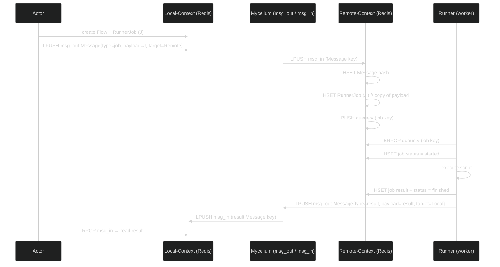
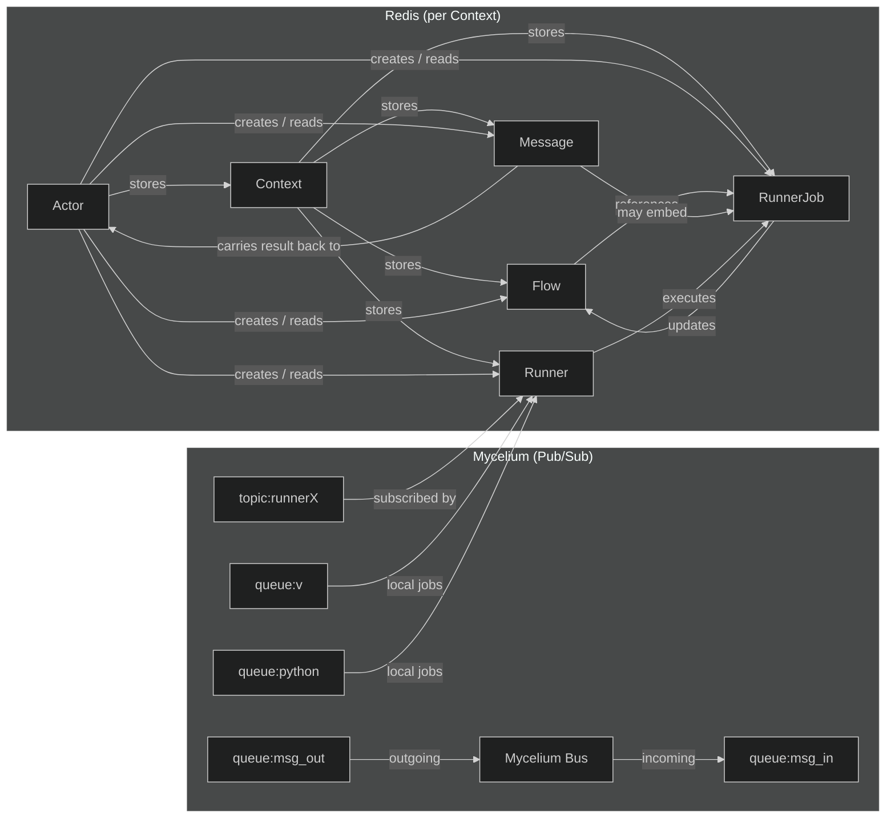
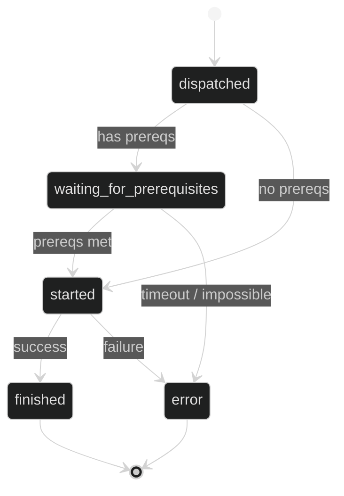
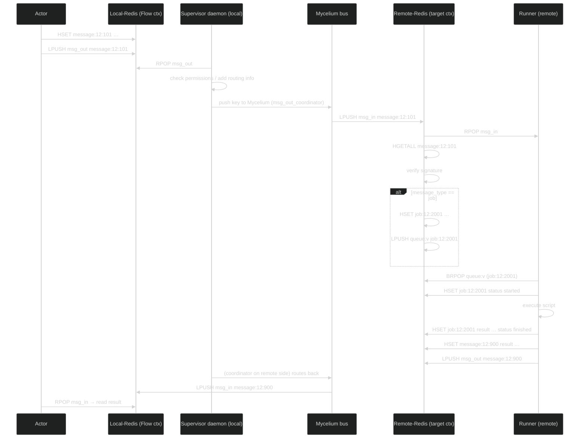
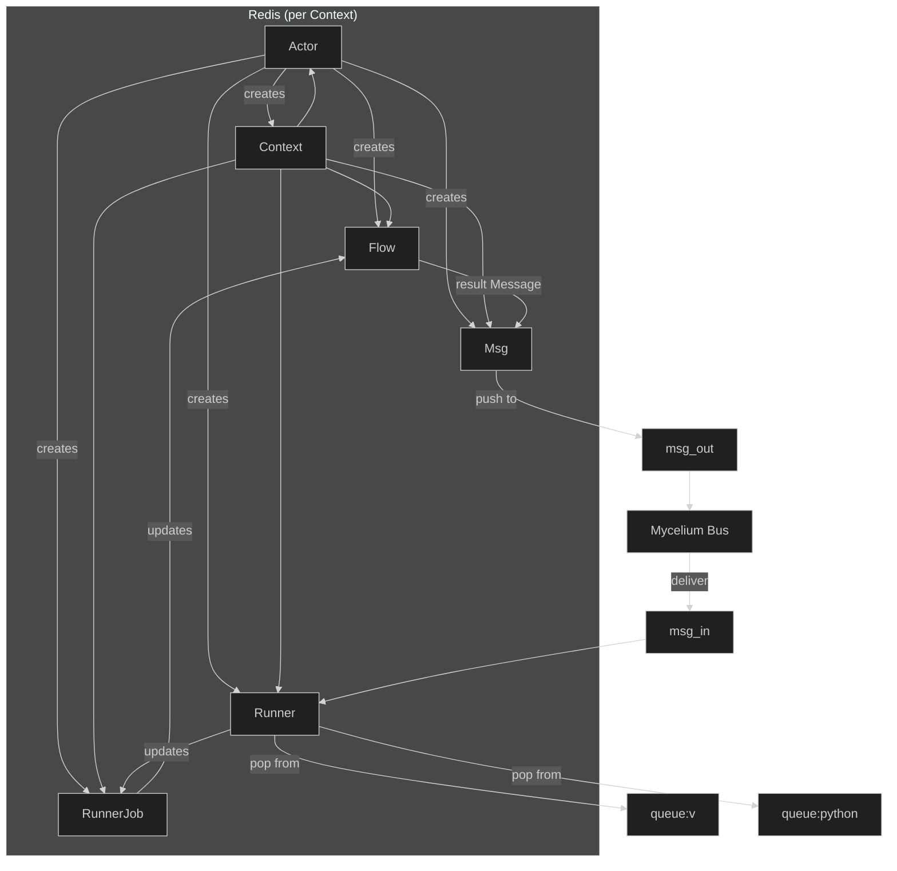

## Objects Used

| Component   | What it **stores**                                                                                                                                                                                                                     | Where it lives (Redis key)                | Main responsibilities                                                                                                                                                                                                                                                                                                                                                                                                                                                                                                                                                                                                 |
|------------|----------------------------------------------------------------------------------------------------------------------------------------------------------------------------------------------------------------------------------------|-------------------------------------------|-------------------------------------------------------------------------------------------------------------------------------------------------------------------------------------------------------------------------------------------------------------------------------------------------------------------------------------------------------------------------------------------------------------------------------------------------------------------------------------------------------------------------------------------------------------------------------------------------------------------|
| **Actor**  | Public key, reachable addresses, timestamps                                                                                                                                                                                                 | `actor:<id>` (hash)                       | An identity that can request work, receive results and act as an administrator of a *Context*.                                                                                                                                                                                                                                                                                                                                                                                                                                                                                                                |
| **Context**| Permission lists (`admins`, `readers`, `executors`), timestamps                                                                                                                                                                          | `context:<id>` (hash)                    | An isolated “tenant” – a separate Redis DB and filesystem area. All objects (flows, messages, jobs, runners) belonging to a given workflow are stored under this context. The permission lists control who may read, execute or administer the context.                                                                                                                                                                                                                                                                                                                                                     |
| **Flow**   | DAG of job IDs, env‑vars, result map, status, timestamps                                                                                                                                                                                | `flow:<id>` (hash)                        | A high‑level workflow created by a single **Actor**. It groups many **RunnerJob** objects, records their execution order, supplies common environment variables and aggregates the final result.                                                                                                                                                                                                                                                                                                                                                                                                                     |
| **Message**| Payload, type (`job\|chat\|mail`), format (`html\|text\|md`), time‑outs, embedded **Job** objects, log stream, status, timestamps                                                                                                                | `message:<caller_id>:<id>` (hash)         | The transport unit that travels over **Mycelium** (the pub/sub/message bus). A message can contain a **RunnerJob** (or a list of jobs) and is queued in two generic Redis lists: `msg_out` (to be sent) and `msg_in` (already received).                                                                                                                                                                                                                                                                                                                                                                          |
| **Runner** | Public key, Mycelium address, topic name, type (`v\|python\|osis\|rust`), local flag, timestamps                                                                                                                                          | `runner:<id>` (hash)                      | The *worker* that actually executes **RunnerJob** scripts. It subscribes to a Mycelium topic (normally `runner<id>`). If `local == true` the runner also consumes jobs directly from a Redis queue that is named after the script‑type suffix (`v`, `python`, …).                                                                                                                                                                                                                                                                                                                                 |
| **RunnerJob**| Script source, type (`osis\|sal\|v\|python`), env‑vars, prerequisites, dependencies, status, timestamps, result map                                                                                                                       | `job:<caller_id>:<id>` (hash)             | A single executable unit. It lives inside a **Context**, belongs to a **Runner**, and is queued according to its `script_type` (e.g. `queue:python`). Its status moves through the lifecycle `dispatched → waiting_for_prerequisites → started → finished|error`.                                                                                                                                                                                                                                                                                                                                 |

> **Key idea:** All objects are persisted as *hashes* in a **Redis** database that is dedicated to a *Context*. The system is completely **decentralised** – each actor owns its own context and can spin up as many runners as needed. Communication between actors, runners and the rest of the system happens over **Mycelium**, a message‑bus that uses Redis lists as queues.

---

## Interaction diagram (who talks to who)

### Sequence diagram – “Submit a flow and run it”

### 2.2 Component diagram – “Static view of objects & links”

### 2.3 Flow‑status life‑cycle (state diagram)

---

## 3️⃣ Redis objects – concrete key & data layout

All objects are stored as **hashes** (`HSET`). Below is a concise catalog that can be copied into a design doc.

| Key pattern | Example | Fields (type) | Comments |
|-------------|---------|---------------|----------|
| `actor:${id}` | `actor:12` | `id` u32, `pubkey` str, `address` list\<Address\>, `created_at` u32, `updated_at` u32 | One hash per actor. |
| `context:${id}` | `context:7` | `id` u32, `admins` list\<u32\>, `readers` list\<u32\>, `executors` list\<u32\>, `created_at` u32, `updated_at` u32 | Holds permission lists for a tenant. |
| `flow:${id}` | `flow:33` | `id` u32, `caller_id` u32, `context_id` u32, `jobs` list\<u32\>, `env_vars` map\<str,str\>, `result` map\<str,str\>, `created_at` u32, `updated_at` u32, `status` str (`dispatched|started|error|finished`) |
| `message:${caller_id}:${id}` | `message:12:101` | `id` u32, `caller_id` u32, `context_id` u32, `message` str, `message_type` str (`job|chat|mail`), `message_format_type` str (`html|text|md`), `timeout` u32, `timeout_ack` u32, `timeout_result` u32, `job` list\<RunnerJob\> (serialized), `logs` list\<Log\>, `created_at` u32, `updated_at` u32, `status` str (`dispatched|acknowledged|error|processed`) |
| `runner:${id}` | `runner:20` | `id` u32, `pubkey` str, `address` str, `topic` str, `local` bool, `created_at` u32, `updated_at` u32 |
| `job:${caller_id}:${id}` | `job:12:2001` | `id` u32, `caller_id` u32, `context_id` u32, `script` str, `script_type` str (`osis|sal|v|python`), `timeout` u32, `retries` u8, `env_vars` map\<str,str\>, `result` map\<str,str\>, `prerequisites` list\<str\>, `dependends` list\<u32\>, `created_at` u32, `updated_at` u32, `status` str (`dispatched|waiting_for_prerequisites|started|error|finished`) |

#### Queue objects (lists)

| Queue name | Purpose |
|------------|---------|
| `msg_out` | **Outbound** generic queue – every `Message` that an actor wants to send is pushed here. |
| `msg_in`  | **Inbound** generic queue – every message received from Mycelium is placed here for the local consumer to process. |
| `queue:${suffix}` (e.g. `queue:v`, `queue:python`) | Local job queues used by a **Runner** when `local == true`. The suffix comes from `ScriptType.queue_suffix()`. |

---

## 4️⃣ System specification (as a concise “specs” section)

### 4.1 Naming conventions
*   All Redis **hashes** are prefixed with the object name (`actor:`, `context:`, …).
*   All **queues** are simple Redis lists (`LPUSH` / `RPOP`).
*   **Message** keys embed both the *caller* and a locally unique *message id* – this guarantees global uniqueness across contexts.

### 4.2 Permissions & security
*   Only IDs present in `Context.admins` may **create** or **delete** any object inside that context.
*   `Context.readers` can **GET** any hash but not modify it.
*   `Context.executors` are allowed to **update** `RunnerJob.status`, `result` and to **pop** from local job queues.
*   Every `Actor` must present a `pubkey` that can be verified by the receiving side (Mycelium uses asymmetric crypto).

### 4.3 Message flow (publish / consume)

Below is a **re‑written “Message flow (publish / consume)”** that reflects the real runtime components:

* **Supervisor daemon** – runs on the node that owns the **Flow** (the *actor’s* side).  
  It is the only process that ever **RPOP**s from the global `msg_out` queue, adds the proper routing information and hands the message to **Mycelium**.

* **Mycelium** – the pure pub/sub/message‑bus. It never touches Redis directly; it only receives a *payload key* from the coordinator and delivers that key to the remote tenant’s `msg_in` list.

* **Remote‑side runner / service** – consumes from its own `msg_in`, materialises the job and executes it.

The table now uses the exact component names and adds a short note about the permission check that the coordinator performs before it releases a message.

| # | Action (what the system does) | Component that performs it | Redis interaction (exact commands) |
|---|-------------------------------|----------------------------|------------------------------------|
| **1️⃣ Publish** | Actor creates a `Message` hash and **LPUSH**es its key onto the *outbound* queue. | **Actor** (client code) | `HSET message:12:101 …`    `LPUSH msg_out message:12:101` |
| **2️⃣ Coordinate & route** | The **Supervisor daemon** (running at source) **RPOP**s the key, checks the actor’s permissions, adds the *target‑context* and *topic* fields, then forwards the key to Mycelium. | **Supervisor daemon** (per‑actor) | `RPOP msg_out`  →  (in‑process) → `LPUSH msg_out_coordinator <key>` (internal buffer) |
| **3️⃣ Transport** | Mycelium receives the key, looks at `Message.message_type` (or the explicit `topic`) and pushes the key onto the *inbound* queue of the **remote** tenant. | **Mycelium bus** (network layer) | `LPUSH msg_in:<remote‑ctx> <key>` |
| **4️⃣ Consume** | The **Remote side** (runner or service) **RPOP**s from its `msg_in`, loads the full hash, verifies the actor’s signature and decides what to do based on `message_type`. | **Remote consumer** (runner / service | `RPOP msg_in:<remote‑ctx>` → `HGETALL message:<key>` |
| **5️⃣ Job materialisation** | If `message_type == "job"` the consumer creates a **RunnerJob** entry inside the **remote** context, adds the job **key** to the proper *script‑type* queue (`queue:v`, `queue:python`, …). | **Remote consumer** | `HSET job:<caller_id>:<job_id> …`   `LPUSH queue:<script_type> job:<caller_id>:<job_id>` |
| **6️⃣ Runner execution loop** | A **Runner** attached to that remote context **BRPOP**s from its script‑type queue, sets `status = started`, runs the script, writes `result` and final `status`. | **Runner** | `BRPOP queue:<script_type>` → `HSET job:<…> status started` → … → `HSET job:<…> result … status finished` |
| **7️⃣ Result notification** | The runner builds a new `Message` (type `chat`, `result`, …) and pushes it onto **msg_out** again. The **Supervisor daemon** on the *originating* side will later pick it up and route it back to the original actor. | **Runner** → **Supervisor (remote side)** → **Mycelium** → **Supervisor (origin side)** → **Actor** | `HSET message:<res_key> …`   `LPUSH msg_out message:<res_key>` (steps 2‑3 repeat in reverse direction) |

---

## Tiny end‑to‑end sequence (still simple enough to render)

## 5️⃣ What the **system** is trying to achieve

| Goal | How it is realized |
|------|--------------------|
| **Decentralised execution** | Every *actor* owns a **Context**; any number of **Runners** can be attached to that context, possibly on different machines, and they all talk over the same Mycelium/Redis backend. |
| **Fine‑grained permissions** | `Context.admins/readers/executors` enforce who can create, view or run jobs. |
| **Loose coupling via messages** | All actions (job submission, result propagation, chat, mail …) use the generic `Message` object; the same transport pipeline handles all of them. |
| **Workflow orchestration** | The **Flow** object models a DAG of jobs, tracks collective status and aggregates results, without needing a central scheduler. |
| **Pluggable runtimes** | `ScriptType` and `RunnerType` let a runner choose the proper execution environment (V, Python, OSIS, Rust, …) – adding a new language only means adding a new `ScriptType` and a corresponding worker. |
| **Observability** | `Log` arrays attached to a `Message` and the timestamps on every hash give a complete audit trail. |
| **Resilience** | Jobs are idempotent hash entries; queues are persisted in Redis, and status changes are atomic (`HSET`). Retries and time‑outs guarantee eventual consistency. |

---

## 6️⃣ Diagram summary (quick visual cheat‑sheet)

