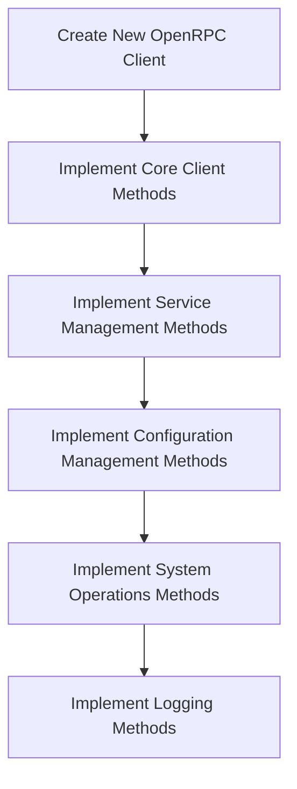
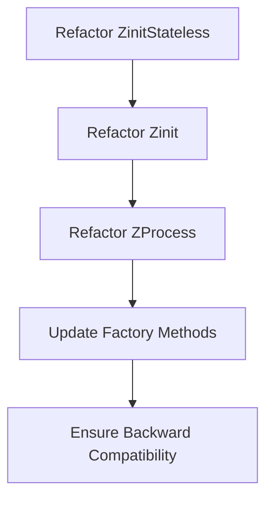
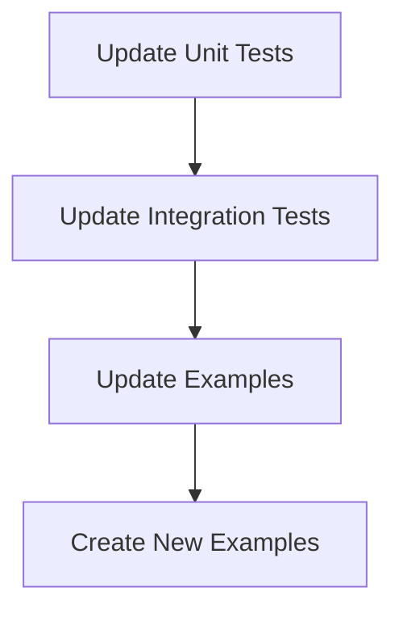
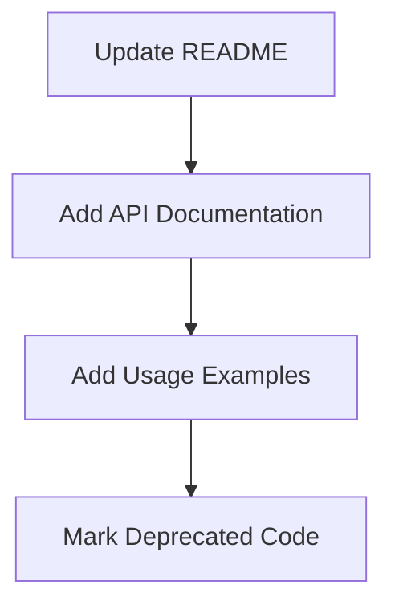

# Implementation Plan: Zinit OpenRPC Client Refactoring

## Current State Analysis
- Multiple implementations (zinit.v, zinit_stateless.v, rpc.v, zprocess.v)
- Inconsistent use of OpenRPC vs. direct filesystem operations
- Duplication of functionality across multiple files
- Lack of a unified approach

## Implementation Plan

### Phase 1: Create a New Unified OpenRPC Client
1. Create a new file `zinit_client.v` with a unified `ZinitClient` struct
2. Implement all methods using the OpenRPC protocol exclusively
3. Ensure the client handles all error cases properly
4. Add comprehensive documentation for all methods



### Phase 2: Refactor Existing Implementations
1. Refactor `ZinitStateless` to use the new client for all operations
2. Refactor `Zinit` to use the new client for all operations
3. Refactor `ZProcess` to use the new client for all operations
4. Update factory methods to use the new client
5. Ensure backward compatibility by maintaining the same API/interface



### Phase 3: Update Tests and Examples
1. Update existing tests to use the new client
2. Add new tests to cover all OpenRPC methods
3. Update examples to demonstrate the new client
4. Create new examples to showcase best practices



### Phase 4: Documentation and Cleanup
1. Update the README with comprehensive documentation
2. Add detailed API documentation for all methods
3. Add usage examples for common scenarios
4. Mark old implementations as deprecated (with a migration guide)



## Detailed Implementation Steps

### 1. Create New OpenRPC Client (zinit_client.v)

```v
module zinit

import freeflowuniverse.herolib.schemas.jsonrpc
import json

// ZinitClient is a unified client for interacting with Zinit using OpenRPC
pub struct ZinitClient {
pub mut:
    rpc_client &jsonrpc.Client
}

// new_client creates a new Zinit OpenRPC client
pub fn new_client(socket_path string) ZinitClient {
    mut cl := jsonrpc.new_unix_socket_client(socket_path)
    return ZinitClient{
        rpc_client: cl
    }
}

// Implement all OpenRPC methods...
```

### 2. Refactor ZinitStateless (zinit_stateless.v)

```v
module zinit

import freeflowuniverse.herolib.core.pathlib

@[params]
pub struct ZinitConfig {
    path        string = '/etc/zinit'
    pathcmds    string = '/etc/zinit/cmds'
    socket_path string = default_socket_path
}

pub struct ZinitStateless {
pub mut:
    client ZinitClient
    path   pathlib.Path
    pathcmds pathlib.Path
}

pub fn new_stateless(z ZinitConfig) !ZinitStateless {
    return ZinitStateless{
        client: new_client(z.socket_path)
        path: pathlib.get_dir(path: z.path, create: true)!
        pathcmds: pathlib.get_dir(path: z.pathcmds, create: true)!
    }
}

// Refactor methods to use the OpenRPC client...
```

### 3. Refactor Zinit (zinit.v)

```v
module zinit

import freeflowuniverse.herolib.core.pathlib

@[heap]
pub struct Zinit {
pub mut:
    processes map[string]ZProcess
    path      pathlib.Path
    pathcmds  pathlib.Path
    client    ZinitClient
}

// Refactor methods to use the OpenRPC client...
```

### 4. Refactor ZProcess (zprocess.v)

```v
module zinit

pub struct ZProcess {
pub:
    name string = 'default'
pub mut:
    cmd         string
    cmd_stop    string
    cmd_test    string
    workdir     string
    status      ZProcessStatus
    pid         int
    after       []string
    env         map[string]string
    oneshot     bool
    start       bool = true
    restart     bool = true
    description string
    client      &ZinitClient
}

// Refactor methods to use the OpenRPC client...
```

## Key Changes Required

1. **Replace Direct Filesystem Operations**:
   - Replace file creation/modification with `service_create` OpenRPC calls
   - Replace file deletion with `service_delete` OpenRPC calls
   - Replace file reading with `service_get` OpenRPC calls

2. **Replace Shell Commands**:
   - Replace `zinit list` shell commands with `service_list` OpenRPC calls
   - Replace `zinit status` shell commands with `service_status` OpenRPC calls
   - Replace `zinit log` shell commands with `stream_currentLogs` OpenRPC calls

3. **Unify Error Handling**:
   - Implement consistent error handling across all methods
   - Properly propagate OpenRPC error responses to the caller

4. **Maintain Backward Compatibility**:
   - Keep the same method signatures for public methods
   - Ensure the same behavior for all methods
   - Add deprecation notices for methods that will be removed in the future

## Testing Strategy

1. **Unit Tests**:
   - Test each OpenRPC method individually
   - Test error handling for each method
   - Test with mock responses for predictable testing

2. **Integration Tests**:
   - Test with a real Zinit instance
   - Test the full lifecycle of services (create, start, status, stop, delete)
   - Test edge cases and error conditions

3. **Backward Compatibility Tests**:
   - Test existing code that uses the old implementations
   - Ensure no regressions in functionality

## Documentation Updates

1. **README.md**:
   - Update with comprehensive documentation
   - Add examples for common use cases
   - Add migration guide for users of the old implementations

2. **API Documentation**:
   - Document all public methods
   - Document all structs and their fields
   - Document error conditions and how to handle them

3. **Examples**:
   - Update existing examples
   - Add new examples for common use cases
   - Add examples for error handling